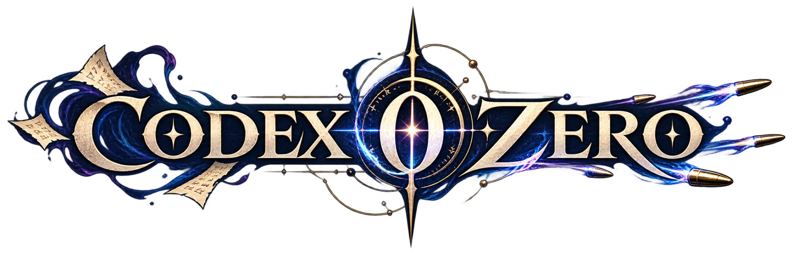
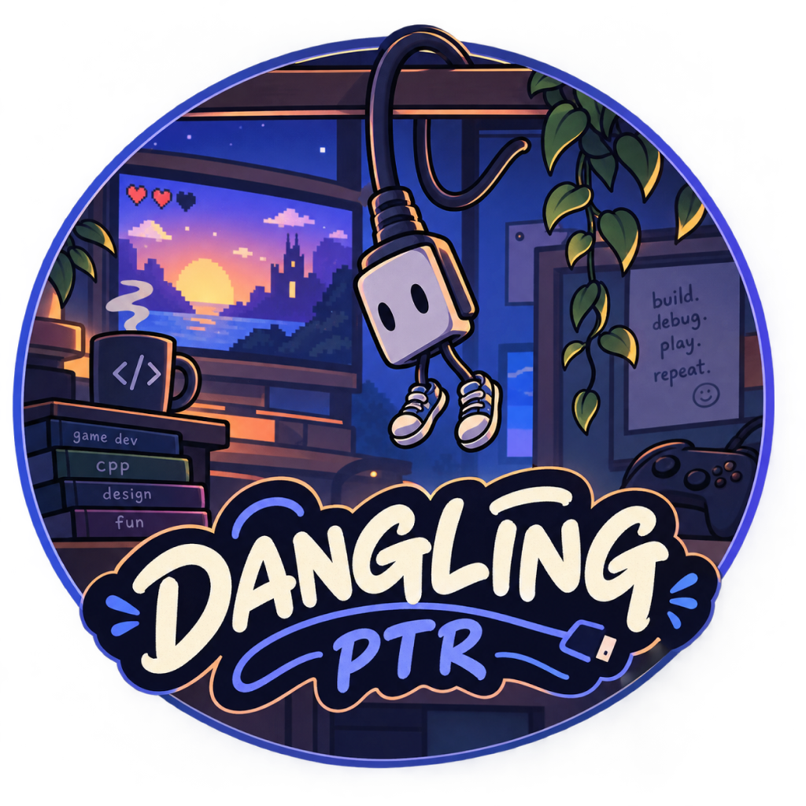

Codex-Zero is an early-stage game project.

Early prototype development took place in this repository:: [Project-Hail-Mary](https://github.com/ZacharyOllivierre/Project-Hail-Mary)

## Licensing

Project-authored source code, build files, tests, documentation, and editable
asset configuration files are licensed under
[MIT](LICENSE). Protected game assets are not covered by that grant:
see [the assets license](assets/LICENSE.md). Third-party dependencies retain
their own licenses; see [Third-Party Notices](THIRD_PARTY_NOTICES.md).

## Team & Credits

### Development Team
#### 

  
  <h3>Dangling Pointer Project Team</h3>

